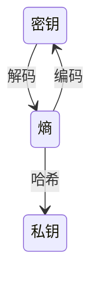
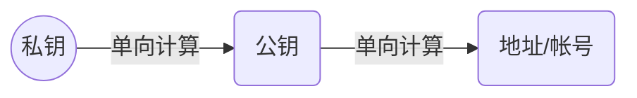
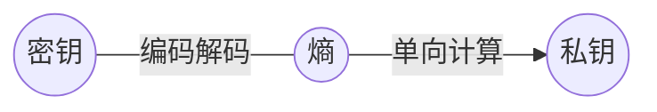
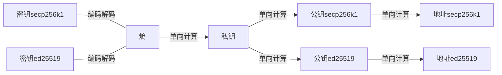
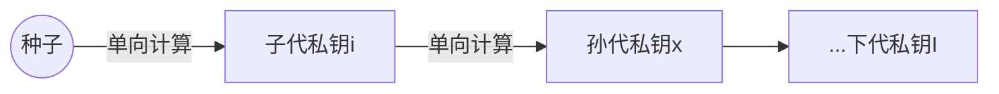
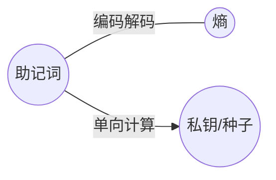
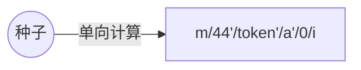

# 井通钱包介绍

[[toc]]

## 大致约定

| 名称               | 名称             |                                                                                                     描述 |
| ------------------ | ---------------- | -------------------------------------------------------------------------------------------------------: |
| **进制**           | base-x           |                                                                        二进制 十进制 十六进制 五十八进制 |
| **编码/解码**      | encode/decode    |                                                            信息的形式转换 <br> 进制转换也是一种编码/解码 |
| **加密/解密**      | encrypt/decrypt  |                                                                    信息的加密还原 <br> 属于编码/解码范畴 |
| **签名/验签**      | sign/verify      |                                                                                           信息的声明确认 |
| **密码算法**       | crypto-algorithm |                                                   井通支持多种算法 <br>sm2p256v1(国密)/secp256k1/ed25519 |
| **熵**             | entropy          |                                                                                               128 位整数 |
| **密钥**           | secret           |                                                                        base58 字符串 <br> 种子做编码得到 |
| **私钥**           | privateKey       |                                   256 位整数 <br> 安全由随机性保证 <br> 可以由熵单向哈希生成或者随机生成 |
| **公钥**           | publicKey        |                                                           256 位整数 <br> 由私钥通过单向加密算法计算得到 |
| **密钥对**         | keypairs         |                                                                                           私钥和公钥集合 |
| **地址/账户**      | address/account  |                                                      base58 字符串 <br> 由公钥通过单向算法计算得到并编码 |
| **钱包**           | wallet           |                                             拥有密钥或者私钥即拥有对应的钱包 <br> 可以操作区块链上的资产 |
| **比特币改进建议** | BIP              |                                                              比特币协议/约定更新 <br> 大致通用于区块链界 |
| **bip32/分层钱包** | HDWallet         | 使用一个主私钥管理多个私钥的改进约定 <br> 可以推导出多层次的子私钥/孙私钥等 <br> 主私钥通常记为种子/seed |
| **bip39/助记词**   | Mnemonic         |                                用助记词简化密钥/私钥的改进约定 <br> 可以由助记词确定性推导出密钥或者私钥 |
| **bip44/规范**     | bip44-constants  |                                                 用来规范化 bip32 的私钥推导路径 <br> 是 bip43 的一种实现 |

::: tip @swtc 开发包
所有的@swtc 开发包使用 scoped 发布 `@swtc/lib-name`

<vue-typed-js :strings="swtclibs">
  <p>const pkg = require("@swtc/<span class="typing"></span>")</p>
</vue-typed-js>
:::

## 关系

::: tip 可逆计算（如 编码解码） 单向计算(如 哈希)
:::
::: details 代码示例

```javascript
> .load ac.js
const { Keypairs } = require("@swtc/keypairs")
const { addressCodec } = require("@swtc/address-codec")
const entropy = Buffer.alloc(16)  // 128位整数， 0
let secret = addressCodec.encodeSeed(entropy)
let secret_ed = addressCodec.encodeSeed(entropy, "ed25519")
console.log(`密钥是base58编码后的熵: ${secret}`)
console.log(`ed25519算法的密钥: ${secret_ed}`)
console.log("解码后：secp256k1")
console.log(addressCodec.decodeSeed(secret))
console.log("解码后：ed25519")
console.log(addressCodec.decodeSeed(secret_ed))
console.log(`ed25519私钥直接由熵哈希得到：\n\t${Buffer.from(Keypairs.hash(entropy)).toString('hex')}`)

密钥是base58编码后的熵: sp6JS7f14BuwFY8Mw6bTtLKWauoUs
ed25519算法的密钥: sEdSJHS4oiAdz7w2X2ni1gFiqtbJHqE
解码后：secp256k1
{
  version: [ 33 ],
  bytes: <Buffer 00 00 00 00 00 00 00 00 00 00 00 00 00 00 00 00>,
  type: 'secp256k1'
}
解码后：ed25519
{
  version: [ 1, 225, 75 ],
  bytes: <Buffer 00 00 00 00 00 00 00 00 00 00 00 00 00 00 00 00>,
  type: 'ed25519'
}
ed25519私钥直接由熵哈希得到：
	0b6cbac838dfe7f47ea1bd0df00ec282fdf45510c92161072ccfb84035390c4d
undefined
>
```

:::



::: tip 私钥 -> 公钥 -> 地址
:::
::: details 代码示例

```javascript
> .load pk.js
const { Keypairs } = require("@swtc/keypairs")

const entropy = Buffer.alloc(16)  // 128位整数， 0
privateKey = Buffer.from(Keypairs.hash(entropy)).toString('hex').toUpperCase()
console.log(`私钥（ed25519）：${privateKey}`)

const keypair = Keypairs.deriveKeypair(privateKey, "ed25519")
console.log(keypair)

const address = Keypairs.deriveAddress(keypair.publicKey)
console.log(`地址： ${address}`)

私钥（ed25519）：0B6CBAC838DFE7F47EA1BD0DF00EC282FDF45510C92161072CCFB84035390C4D
{
  privateKey: 'ED0B6CBAC838DFE7F47EA1BD0DF00EC282FDF45510C92161072CCFB84035390C4D',
  publicKey: 'ED1A7C082846CFF58FF9A892BA4BA2593151CCF1DBA59F37714CC9ED39824AF85F'
}
地址： j9zRhGj7b6xPekLvT6wP4qNdWMjyaumZS7
undefined
>
```

:::



::: tip 密钥 &lt;==&gt; 熵 -> 私钥
:::
::: details 代码示例

```javascript
> .load ac.js
const { Keypairs } = require("@swtc/keypairs")
const { addressCodec } = require("@swtc/address-codec")
const entropy = Buffer.alloc(16)  // 128位整数， 0
let secret = addressCodec.encodeSeed(entropy)
let secret_ed = addressCodec.encodeSeed(entropy, "ed25519")
console.log(`密钥是base58编码后的熵: ${secret}`)
console.log(`ed25519算法的密钥: ${secret_ed}`)
console.log("解码后：secp256k1")
console.log(addressCodec.decodeSeed(secret))
console.log("解码后：ed25519")
console.log(addressCodec.decodeSeed(secret_ed))
console.log(`ed25519私钥直接由熵哈希得到：\n\t${Buffer.from(Keypairs.hash(entropy)).toString('hex')}`)

密钥是base58编码后的熵: sp6JS7f14BuwFY8Mw6bTtLKWauoUs
ed25519算法的密钥: sEdSJHS4oiAdz7w2X2ni1gFiqtbJHqE
解码后：secp256k1
{
  version: [ 33 ],
  bytes: <Buffer 00 00 00 00 00 00 00 00 00 00 00 00 00 00 00 00>,
  type: 'secp256k1'
}
解码后：ed25519
{
  version: [ 1, 225, 75 ],
  bytes: <Buffer 00 00 00 00 00 00 00 00 00 00 00 00 00 00 00 00>,
  type: 'ed25519'
}
ed25519私钥直接由熵哈希得到：
	0b6cbac838dfe7f47ea1bd0df00ec282fdf45510c92161072ccfb84035390c4d
undefined
>
```

:::



::: tip 加密算法 影响 熵->密钥 私钥->公钥 签名/验签
:::
::: details 代码示例

```javascript
> .load ac.js
const { Keypairs } = require("@swtc/keypairs")
const { addressCodec } = require("@swtc/address-codec")
const entropy = Buffer.alloc(16)  // 128位整数， 0
let secret = addressCodec.encodeSeed(entropy)
let secret_ed = addressCodec.encodeSeed(entropy, "ed25519")
console.log(`密钥是base58编码后的熵: ${secret}`)
console.log(`ed25519算法的密钥: ${secret_ed}`)
console.log("解码后：secp256k1")
console.log(addressCodec.decodeSeed(secret))
console.log("解码后：ed25519")
console.log(addressCodec.decodeSeed(secret_ed))
console.log(`ed25519私钥直接由熵哈希得到：\n\t${Buffer.from(Keypairs.hash(entropy)).toString('hex')}`)
let keypairs = Keypairs.deriveKeypair(secret)
console.log("密钥对：(sec256k1私钥加了前缀00)")
console.log(keypairs)
let keypairs_ed = Keypairs.deriveKeypair(secret_ed)
console.log("密钥对：(ed25519加了前缀ED)")
console.log(keypairs_ed)

密钥是base58编码后的熵: sp6JS7f14BuwFY8Mw6bTtLKWauoUs
ed25519算法的密钥: sEdSJHS4oiAdz7w2X2ni1gFiqtbJHqE
解码后：secp256k1

{
  version: [ 33 ],
  bytes: <Buffer 00 00 00 00 00 00 00 00 00 00 00 00 00 00 00 00>,
  type: 'secp256k1'
}

解码后：ed25519

{
  version: [ 1, 225, 75 ],
  bytes: <Buffer 00 00 00 00 00 00 00 00 00 00 00 00 00 00 00 00>,
  type: 'ed25519'
}

ed25519私钥直接由熵哈希得到：
	0b6cbac838dfe7f47ea1bd0df00ec282fdf45510c92161072ccfb84035390c4d
密钥对：(sec256k1私钥加了前缀00)
{
  privateKey: '002512BBDFDBB77510883B7DCCBEF270B86DEAC8B64AC762873D75A1BEE6298665',
  publicKey: '0390A196799EE412284A5D80BF78C3E84CBB80E1437A0AECD9ADF94D7FEAAFA284'
}
密钥对：(ed25519加了前缀ED)
{
  privateKey: 'ED0B6CBAC838DFE7F47EA1BD0DF00EC282FDF45510C92161072CCFB84035390C4D',
  publicKey: 'ED1A7C082846CFF58FF9A892BA4BA2593151CCF1DBA59F37714CC9ED39824AF85F'
}
undefined
>
```

:::



::: tip BIP32 种子 -> 子孙后代私钥
每代都有兄弟私钥<br>
一个种子私钥管理许多钱包<br>
推导路径 m/g1/g2/g3/g4/...
:::
::: details 代码演示

```javascript{7}
> .load test.js
const bip39 = require("bip39")
const bip32 = require("bip32")
bip39.setDefaultWordlist("chinese_simplified")
const mnemonic = bip39.entropyToMnemonic('00000000000000000000000000000000')
let seed = bip39.mnemonicToSeedSync(mnemonic)
b32 = bip32.fromSeed(seed)

console.log(`主节点 私钥: ${b32.privateKey.toString("hex")}`)

son_son = b32.derivePath("m/0/1")
console.log(`孙节点 m/0/1: ${son_son.privateKey.toString("hex")}`)

主节点 私钥: de515c704d69559b2ad1bd1724cd400097fa5c7b94cce4249f4198239f3e1af2
孙节点 m/0/1: be72cf3eb3c9e5155d3d9cad768f862fdd609ccb3a227f4c596bb1d0885d1e87
undefined
>
```

:::



::: tip BIP39 助记词 -> 熵 助记词 -> 私钥/种子
助记词代替密钥或者私钥的管理
:::
::: details 代码示例

```javascript
> .load test.js
const bip39 = require("bip39")
bip39.setDefaultWordlist("chinese_simplified")

const mnemonic = bip39.entropyToMnemonic('00000000000000000000000000000000')
console.log(mnemonic)

let entropy = bip39.mnemonicToEntropy(mnemonic)
let seed = bip39.mnemonicToSeedSync(mnemonic)
console.log(`助记词 到 熵: ${entropy}`)
console.log(`助记词 到 种子: ${seed.toString("hex")}`)

的 的 的 的 的 的 的 的 的 的 的 在
助记词 到 熵: 00000000000000000000000000000000
助记词 到 种子: c015b86e4b208402bb0bdd0febb746708b869bb6e433cb227fd66d444f3ccdc360fee9ca9271014c2a684df380fcc40bd80a37eaa41a8061a52a18d319cdd899
undefined
>
```

:::



::: tip BIP44 规范化 bip32
一个种子私钥管理许多钱包, 许多通证<br>
bip43 的一个实例<br>
314 0x8000013a MOAC MOAC<br>
315 0x8000013b SWTC SWTC<br>
推导路径 m/44'/token'/a'/0/i
:::
::: details 代码演示

```javascript
> .load t.js
const bip39 = require("bip39")
const bip32 = require("bip32")
const constants = require("bip44-constants")
const getCoin = coin => constants.filter(e => e[1] === coin.toUpperCase())
const SWTC = getCoin('SWTC')[0][0] << 1 >> 1
const MOAC = getCoin('MOAC')[0][0] << 1 >> 1
console.log(SWTC)
bip39.setDefaultWordlist("chinese_simplified")
const mnemonic = bip39.entropyToMnemonic('00000000000000000000000000000000')
let seed = bip39.mnemonicToSeedSync(mnemonic)
b32 = bip32.fromSeed(seed)

console.log(`主节点 私钥: ${b32.privateKey.toString("hex")}`)

let private_key_moac = b32.derivePath(`m/44'/${MOAC}'/0'/0/0`).privateKey
let private_key_swtc = b32.derivePath(`m/44'/${SWTC}'/0'/0/0`).privateKey

console.log(`墨客 第一个私钥: ${private_key_moac.toString("hex")}`)
console.log(`井通 第一个私钥: ${private_key_swtc.toString("hex")}`)

315
主节点 私钥: de515c704d69559b2ad1bd1724cd400097fa5c7b94cce4249f4198239f3e1af2
墨客 第一个私钥: 0e380e7f29a9bdbf0d04e8933e625d244737154b095edcc14dadffb8ae707b01
井通 第一个私钥: 42f255cd10c52ddda2af360b6561caf3275c02bd2e5fce6886c6ddc389ba72e9
undefined
>
```

:::



<script>
export default {
  data () {
      return {
          swtclibs: [
            'lib',
            'transaction',
            'serializer',
            'wallet',
            'keypairs',
			'address-codec'
          ]
      }
  },
}
</script>

## bip 到 swtclib 的完整示例

::: tip bip39 -> 钱包
助记词(bip39) -> 密钥+钱包(swtclib) <br>
助记词(bip39) -> 种子(bip32) -> 私钥(bip44) -> 钱包(swtclib)
:::
::: details 代码

```javascript
> .load test.js
const { Wallet } = require("@swtc/wallet")
const Keypair = Wallet.KeyPair
const addressCodec = Keypair.addressCodec
const bip39 = require("bip39")
const bip32 = require("bip32")
const constants = require("bip44-constants")
const getCoin = coin => constants.filter(e => e[1] === coin.toUpperCase())
const SWTC = getCoin('SWTC')[0][0] << 1 >> 1
console.log(SWTC)
bip39.setDefaultWordlist("chinese_simplified")

let mnemonic, seed, entropy, secret, privateKey, publicKey, address, wallet

for (const length of [128, 160, 192, 224, 256]) {
	mnemonic = bip39.generateMnemonic(length)
	console.log(`\n随机助记词-${Math.ceil(length / 11)}: ${mnemonic}`)
	entropy = bip39.mnemonicToEntropy(mnemonic)
	console.log(`\t熵  : ${entropy.toString("hex")}`)
	console.log(`\t\t密钥-secp256k1: ${addressCodec.encodeSeed(entropy.slice(0,16))}`)
	console.log(`\t\t密钥-ed25519  : ${addressCodec.encodeSeed(entropy.slice(0,16), 'ed25519')}`)
	seed = bip39.mnemonicToSeedSync(mnemonic)
	console.log(`\t种子: ${seed.toString("hex")}`)
	b32 = bip32.fromSeed(seed)
	privateKey = b32.derivePath(`m/44'/${SWTC}'/0'/0/0`).privateKey
	wallet = Wallet.fromSecret(privateKey.toString("hex"))
	console.log(`\t井通第一私钥: ${privateKey.toString("hex")}`)
	console.log(`\t\t井通地址-secp256k1: ${wallet.address}`)
	wallet = new Wallet(privateKey.toString("hex"), "ed25519")
	console.log(`\t\t井通地址-ed25519  : ${wallet.address()}`)
	privateKey = b32.derivePath(`m/44'/${SWTC}'/0'/0/1`).privateKey
	wallet = Wallet.fromSecret(privateKey.toString("hex"))
	console.log(`\t井通第二私钥: ${privateKey.toString("hex")}`)
	console.log(`\t\t井通地址-secp256k1: ${wallet.address}`)
	wallet = new Wallet(privateKey.toString("hex"), "ed25519")
	console.log(`\t\t井通地址-ed25519  : ${wallet.address()}`)
}
entropy = '00000000000000000000000000000000'
mnemonic = bip39.entropyToMnemonic(entropy)
console.log(`\n\n零号助记词-12: ${mnemonic}`)
console.log(`零号熵  : ${entropy.toString("hex")}`)
console.log(`\t零号密钥-secp256k1: ${addressCodec.encodeSeed(entropy.slice(0,16))}`)
console.log(`\t零号密钥-ed25519  : ${addressCodec.encodeSeed(entropy.slice(0,16), 'ed25519')}`)
seed = bip39.mnemonicToSeedSync(mnemonic)
b32 = bip32.fromSeed(seed)
console.log(`零号种子: ${seed.toString("hex")}`)
privateKey = b32.derivePath(`m/44'/${SWTC}'/0'/0/0`).privateKey
wallet = Wallet.fromSecret(privateKey.toString("hex"))
console.log(`零号井通第一私钥: ${privateKey.toString("hex")}`)
console.log(`\t井通地址-secp256k1: ${wallet.address}`)
wallet = new Wallet(privateKey.toString("hex"), "ed25519")
console.log(`\t井通地址-ed25519  : ${wallet.address()}`)
privateKey = b32.derivePath(`m/44'/${SWTC}'/0'/0/1`).privateKey
wallet = Wallet.fromSecret(privateKey.toString("hex"))
console.log(`零号井通第二私钥: ${privateKey.toString("hex")}`)
console.log(`\t井通地址-secp256k1: ${wallet.address}`)
wallet = new Wallet(privateKey.toString("hex"), "ed25519")
console.log(`\t井通地址-ed25519  : ${wallet.address()}`)

315

随机助记词-12: 仍 益 物 曾 江 认 缘 劲 烷 吞 胎 右
	熵  : 592ab82a28e3924a2ae617ec5fefde26
		密钥-secp256k1: spm4RJdtoYsBTAFbpAfoMvjBoHPVx
		密钥-ed25519  : sEdS4MRDKt4z37oyZoxaQpJSXZqzRmX
	种子: 6465fe3ea42c889aed804c1420825d71f36840a01d0a3cafa1c73a363fe2850bb526b9b6a1eb2821f17b3e91931e53459bb5438540e63a6851a562772ca13717
	井通第一私钥: f607013f4b8abe69662b15d67bd20984c3fad75ac0445086366fad2a8bfbf27e
		井通地址-secp256k1: jwenxJr3QpgP1mfG1WRNQVgTtJTnENg9pr
		井通地址-ed25519  : jNnRGAAop12SP9UqnoJhAH8SU7PARWm3dr
	井通第二私钥: b602e00170e1780a7ea20425af3d39be6c93b4330ad3f5a576f10ab4dba4610f
		井通地址-secp256k1: jpx7yVoGP5obo3YADVMFvHwR7vkiTSwy3D
		井通地址-ed25519  : jfpVYMH6J9JRA19ofmFg6reabMJqB8xy7Y

随机助记词-15: 船 无 提 孔 坝 近 敬 云 照 代 巷 亭 流 仔 岩
	熵  : 4d22a85baf0fda64adb2de3ce2cbf77471b1b85e
		密钥-secp256k1: spkXuWBt7eML37Aed2WywpiziVQAQ
		密钥-ed25519  : sEdSMWuQ1thaSd7Wg1YroUaZPLMddqv
	种子: 12189ea71c85362749ba7189ff97ff5e341509528335685d6aad15e0f995a045a63ec09e6d7a7ee91e739717e3f3343ac90c975cc1dd6bfd5ec08145ae9222c3
	井通第一私钥: b506f77179aed1421308fe931518c8caf01e9d19ec6027518b7d0e9f62431420
		井通地址-secp256k1: jDotHnnyzAvEUG7UYPjt5CL15M7GxaVbh9
		井通地址-ed25519  : jfg7KsrmS9s1mDXnUAbmEha3xYZfsTRBMv
	井通第二私钥: 92f70e88a55b9619617feac8aaa7a28b098e4b9e982ab5d479d1ddcb13024701
		井通地址-secp256k1: jKgkp8pYeaXKHmKCTWLTGx8FshtsJPFm1v
		井通地址-ed25519  : jD91q5Et9iBLSzaGGo2TAxYgkSssjUXMZJ

随机助记词-18: 捕 串 鸭 刷 拜 位 祖 究 瓶 玄 领 甜 粮 比 芽 飞 怪 舟
	熵  : 8eba1b2eed4d6830dba979c11fc888f0864e256d8a79aa76
		密钥-secp256k1: spom44bcbddtcE3Ww8ce5hK8LeE6f
		密钥-ed25519  : sEdSQk4HHcBnrBxG1rnAt1e2i9PKYja
	种子: b341006738d7932ac2ea9fcb5e0e2327df440c084318f55929b7d7fc78401e54785f6e73faf67cf7f11818f3366ea4f161597a8b17a600c07af88d2a78e0ff45
	井通第一私钥: d1361359a6a8ee2cab0220639ef55da9674da840dbfd784f42513c6730eb04e4
		井通地址-secp256k1: jJdxsAj566yfHMXdrDJ5ptrTcE4BkmFZoa
		井通地址-ed25519  : jsEhK82PMv5qpguDmp2VQ7TdmVAF6Y1bR6
	井通第二私钥: 6caeeaffb7c2b009ce86bde616020759280379d00af677ba6f7f0575e2da84c2
		井通地址-secp256k1: j9M4ntwhuFgt97VSh1CprFE83QdERNGj6b
		井通地址-ed25519  : jsUT2ErEBC5cYydXDaMZ3EWdpKBgjHrzoE

随机助记词-21: 挖 炼 危 程 房 桂 氢 浓 童 扫 童 肠 依 弓 况 算 鞋 恩 善 更 芳
	熵  : b152c9d50bb56b7a1c4bdaa3f6328ffd555fc70b217fdcd2b1969349
		密钥-secp256k1: sp6JdJjxnH3GuHB8o1PN9NyrWZnAX
		密钥-ed25519  : sEdSJHdU6AerD2EJAjrpCTnmWnr36SM
	种子: 37db9f1803178f1f6e0612dbcb2e51952abdb881b4368b6df7f4e49ce761a171dac5bad6c77ab1f4bf06f6a4a937a42625fb84e96031466355abf7f8e75c431a
	井通第一私钥: f17614d4f84f3760feccd0b9e0fa23fa2c2fd5461c60eafc8eb5d03212ab255d
		井通地址-secp256k1: jhU7KMy4XydStNjivx5dV7jyee5XHs1qGL
		井通地址-ed25519  : jhg6rLuyL3E8PfbPAs4nCJCAy6pW6RnqYN
	井通第二私钥: 08b9ce03c0ed507444c95276b3277f8738e30fdeef8da7e399e617a95227305a
		井通地址-secp256k1: jPmU9NHSn3H97uD8yxQYeVoDZNYRxpSCrc
		井通地址-ed25519  : j4BVdRBcYWEHg6d3KZpvttjLiJcHRUZrF3

随机助记词-24: 董 良 减 浇 阴 是 侨 蒸 削 伍 田 贵 谈 洁 茎 轴 圈 融 公 扣 鼓 答 吗 袭
	熵  : eecaa515eda88600b523c7a075f12a34740565f8c2aa879a2854ebe7d0d718ce
		密钥-secp256k1: sp6JS7f14Lpf6zzRkjKxDgtjucMYx
		密钥-ed25519  : sEdSJHS4oiA8fRhpreCwcBwDQTBmE2R
	种子: 996e4efec5bdd2e90654d4e66834f9108e7515c852de92f669ac224f5f90819fb59d362f65c3576ece927632ada95295892c8463dfa7bb5462c369ae0d34450f
	井通第一私钥: 463552f46b10b25050b60d0cfab0a6139a37c07f49bb3c2947ac9de18af3aba6
		井通地址-secp256k1: jEmskT6pGngn6HcLi5j9gdvYKdfqa6wWnX
		井通地址-ed25519  : jPyYKHr96mcbTYfrf8hmQFC1XSwCYF8Es1
	井通第二私钥: 2e3d518ed16d6741a9e45d0dde20529c740dd69c0cd87662150436e758da34f7
		井通地址-secp256k1: jL4XiAJ4JtC7MTGouViCS8qA2MWooNrRAG
		井通地址-ed25519  : jQESz4B47AKbMSdEyPxkGzBuc2HDQRE3Wo


零号助记词-12: 的 的 的 的 的 的 的 的 的 的 的 在
零号熵  : 00000000000000000000000000000000
	零号密钥-secp256k1: sp6JS7f14BuwFY8Mw6bTtLKWauoUs
	零号密钥-ed25519  : sEdSJHS4oiAdz7w2X2ni1gFiqtbJHqE
零号种子: c015b86e4b208402bb0bdd0febb746708b869bb6e433cb227fd66d444f3ccdc360fee9ca9271014c2a684df380fcc40bd80a37eaa41a8061a52a18d319cdd899
零号井通第一私钥: 42f255cd10c52ddda2af360b6561caf3275c02bd2e5fce6886c6ddc389ba72e9
	井通地址-secp256k1: jLnwXgBewnGXL3a6e24DpQXmzcc6gabTUb
	井通地址-ed25519  : jJPqLrNGcwWmCxEmgpBCnEAbfWuAr2Au96
零号井通第二私钥: 5f339a90404ced22eeedd48fbad16c80db83660b93aea3ff131781b75a8283ca
	井通地址-secp256k1: j4XfDGzF57yKNAs3ndxQ6h98Ruwy5NR8h9
	井通地址-ed25519  : jwD2SNQhGnGT1fNHSnkfsHdTE4cLRaUm13
undefined
>
```

:::

## 移动开发

::: tip 开发框架
`npm install -g nativescript`
:::

::: details 代码

```shell
Documents xcliu$ ns create bipapp --js
Documents xcliu$ cd bipapp
bipapp xcliu$ npm install bip32 bip39 @swtc/wallet @swtc/nativescript
bipapp xcliu$ echo "更新webpack配置 更新程序引入bip和swtc"
bipapp xcliu$ git diff
diff --git a/webpack.config.js b/webpack.config.js
index 4e59599..bde3a35 100644
--- a/webpack.config.js
+++ b/webpack.config.js
@@ -135,7 +135,7 @@ module.exports = env => {
                 `node_modules/${coreModulesPackageName}`,
                 "node_modules",
             ],
-            alias: Object.assign(alias, require("@swtc/nativescript").aliases),
+            alias,
             // resolve symlinks to symlinked modules
             symlinks: true
         },
@@ -264,8 +264,8 @@ module.exports = env => {
             new webpack.DefinePlugin({
                 "global.TNS_WEBPACK": "true",
                 "global.isAndroid": platform === 'android',
-                "global.isIOS": platform === 'ios'
-                // "process": "global.process",
+                "global.isIOS": platform === 'ios',
+                "process": "global.process",
             }),
             // Remove all files from the out dir.
             new CleanWebpackPlugin({
bipapp xcliu$ git diff app
diff --git a/src/main-view-model.ts b/src/main-view-model.ts
index 39e86c5..9d7aef2 100644
--- a/src/main-view-model.ts
+++ b/src/main-view-model.ts
@@ -1,14 +1,25 @@
 import { Observable } from '@nativescript/core';
+import { Wallet } from "@swtc/wallet";
+import { BIP32Interface, fromSeed } from "bip32"
+import { getDefaultWordlist, setDefaultWordlist, generateMnemonic, mnemonicToSeedSync } from "bip39"
+
+setDefaultWordlist('chinese_simplified')
+let mnemonic: string = generateMnemonic()
+let b32: BIP32Interface

 export class HelloWorldModel extends Observable {
     private _counter: number;
     private _message: string;
+    private _mnemonic: string;
+    private _seed: Buffer;

-    constructor() {
+    constructor(mnemonic: string = generateMnemonic()) {
         super();

         // Initialize default values.
         this._counter = 42;
+        this._mnemonic = mnemonic
+        this._seed = mnemonicToSeedSync(mnemonic)
         this.updateMessage();
     }

@@ -25,6 +36,8 @@ export class HelloWorldModel extends Observable {

     onTap() {
         this._counter--;
+        this._mnemonic = generateMnemonic();
+        this._seed = mnemonicToSeedSync(this._mnemonic)
         this.updateMessage();
     }

@@ -33,7 +46,10 @@ export class HelloWorldModel extends Observable {
             this.message =
                 'Hoorraaay! You unlocked the NativeScript clicker achievement!';
         } else {
-            this.message = `${this._counter} taps left`;
+            this.message = `${this._counter} taps left
+${this._mnemonic}
+seed: ${this._seed.toString("hex")}
+`;
         }
     }
 }
bipapp xcliu$ ns run android
```

:::
